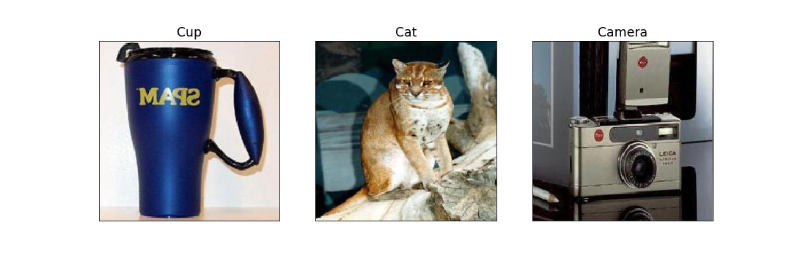
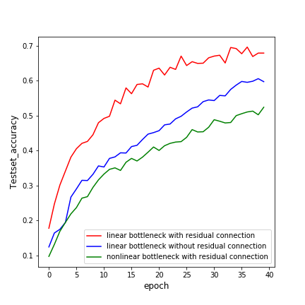

# MobilenetV2 with Pytorch 
```bash
Dataset : Caltech 101 classification dataset 
download link : (http://www.vision.caltech.edu/Image_Datasets/Caltech101/#Download)

Dataset(dir)
  -train(dir) : 6672 images
    -category1
    -category2
        .
        .
        .
    -category 101
  -test(dir) : 1626 images
    same with traindir

Requirements
  pytorch 0.4.0 / tensorboard 
```
# Dataset Example

# Testset Accuracy 
As mentioned in the paper (Figure 6), linear bottleneck with residual connection shows the best performance.
Also, as illustrated in the paper Figure 6-(b), residual connection significantly improves the model performance.

# Hyperparameters
I used the same hyperparameters that are satated in the paepr section 6-1(training setup for imagenet classification) except for the optimizer. When trained with RMSPropOptimizer, training loss diverged for unknown reasons. Therefore, SGD optimizer was used.

